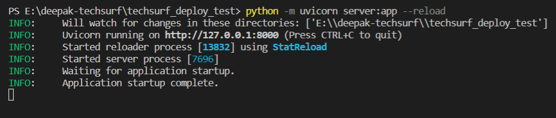
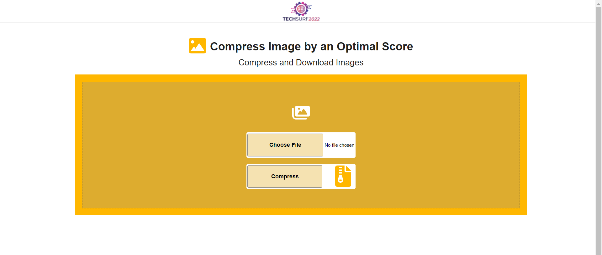
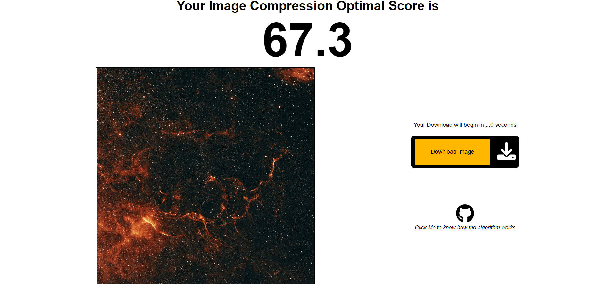

### HOW TO RUN ON LOCAL HOST

- Download/Clone this project
- Run following commands on the terminal in the project directory 

`pip install -r requirements.txt`

`python -m uvicorn server:app --reload`

- Access the running demo on <a>http://127.0.0.1:8000</a> on your browser

### HOW TO GET THE OPTIMAL SCORE & COMPRESSED IMAGE

- Click on the `Choose File` Button and select any image file from your device (Large Size Preferred)
- Click on the `Compress` Button (Some files may take some time/seconds to get compressed)

- On top we will get the <b>OPTIMAL SCORE</b> for the image
- The Optimal Score resembles the extent of compression till which the input image can
be dropped to, while preserving most of the image quality at the same time.
- The left pane will show the output/compressed image
- The `Download` button will get activated within 10 seconds
- Click on `Download` button to the download the compressed image

### HOW THE CODE WORKS

- After reading the image, we specify the GRID_SIZE based on dimension of the image
- Then we split the image in 3 channels, namely Red, Blue and Green
- The DCT(discrete cosine transform) is generated for each channels
- A customised thresholding algorithm runs for each DCTs, where pixels are considered or rejected
- Based on number of rejected pixels for each DCTs we calculate our <b>OPTIMAL SCORE / EXTENT OF COMPRESSION</b>
- Finally, the image is compressed to OPTIMAL SCORE using the pillow library 
